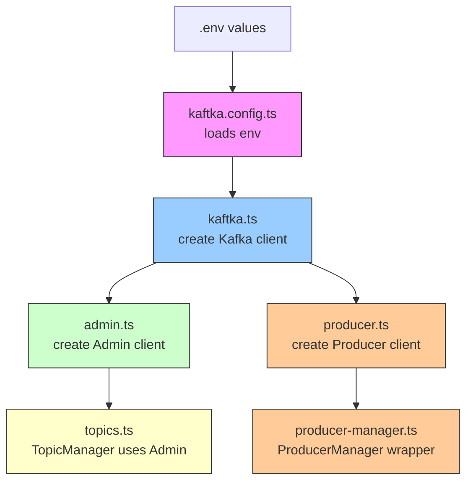

# Confluent Kaftka TypeScript

A Docker-based Confluent Kafka setup with a TypeScript client wrapper built on `@confluentinc/kafka-javascript`.

## Overview

This repository demonstrates a local Kafka development environment using Docker and Confluent's JavaScript client. It includes:

- A KRaft-style Kafka deployment with dedicated controller and broker nodes.
- A TypeScript wrapper that loads `.env` configuration, creates Kafka clients, manages topics, and publishes events.
- Documentation for setup and configuration flow.

## Prerequisites

- Docker and Docker Compose (v2+)
- Node.js and npm

## JavaScript client

Initialize the project and install Confluent's JavaScript client:

```bash
npm init -y
npm install @confluentinc/kafka-javascript
```

`@confluentinc/kafka-javascript` is Confluent's official JavaScript client for Apache Kafka and the Confluent Platform.

## Docker image selection

This setup uses the `apache/kafka:4.3.0` image for the following reasons:

- `bitnami/kafka:latest` is no longer available for free on Docker Hub.
- `confluentinc/confluent-local:8.0.0` does not support running dedicated controller and broker roles separately.
- The project architecture requires separate controller instances for a production-like topology.

## Architecture

The target topology for this project is:

- 2 dedicated controllers
- 2 dedicated brokers

This topology helps emulate a production-like environment with separate controller and broker responsibilities.

## Project structure

- `src/config/kaftka.config.ts` — loads `.env` and exposes Kafka connection settings
- `src/kaftka/kaftka.ts` — creates the shared Kafka client
- `src/kaftka/admin.ts` — creates the Kafka Admin client
- `src/kaftka/topics.ts` — topic manager for listing and creating topics
- `src/kaftka/producer.ts` — creates the Kafka producer
- `src/kaftka/producer-manager.ts` — wraps producer operations for publish/flush

## Commands

Start the environment:

```bash
docker compose up -d
```

Stop and remove the environment:

```bash
docker compose down
```

## Setup steps

1. Create or verify `docker-compose.yml` with controller and broker services.
2. Verify Docker, Node.js, and npm are installed.
3. Start Kafka with `docker compose up -d`.
4. Install the JavaScript client and run your TypeScript application.

## Notes

- Use `docker compose logs -f` to follow service startup and troubleshoot issues.
- Adjust Docker resource limits and network settings as needed for your machine.
- The project retains `Instruction.md` and `config-flow.md` as companion docs.

---

## Configuration Flow

This section explains how configuration is passed through the TypeScript client layer.

### Flow overview

1. `.env` values are loaded in `src/config/kaftka.config.ts`
2. `src/kaftka/kaftka.ts` creates the main Kafka client using that config
3. `src/kaftka/admin.ts` creates the Kafka Admin client from the Kafka client
4. `src/kaftka/topics.ts` is the topic manager that uses `admin` to create and describe topics
5. `src/kaftka/producer.ts` creates the producer client
6. `src/kaftka/producer-manager.ts` wraps `producer.ts` and exposes publish/flush functions

### Flow diagram



## Companion documents

- `Instruction.md` — full setup and installation instructions
- `config-flow.md` — flow diagram and configuration explanation
