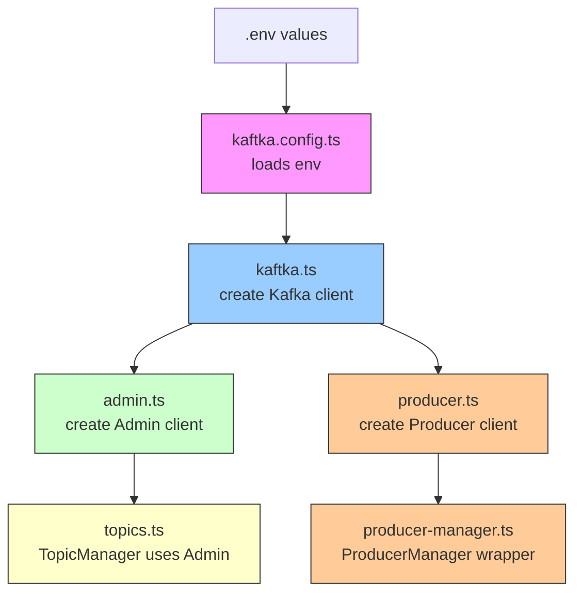

# Kaftka Configuration Flow

This document explains the startup flow for the Kaftka project.

## Flow Overview

1. `.env` values are loaded in `src/config/kaftka.config.ts`
2. `src/kaftka/kaftka.ts` creates the main Kafka client using that config
3. `src/kaftka/admin.ts` creates the Kafka Admin client from the Kafka client
4. `src/kaftka/topics.ts` is the topic manager that uses `admin` to create and describe topics
5. `src/kaftka/producer.ts` creates the producer client
6. `src/kaftka/producer-manager.ts` wraps `producer.ts` and exposes publish/flush functions

## Mermaid Diagram

