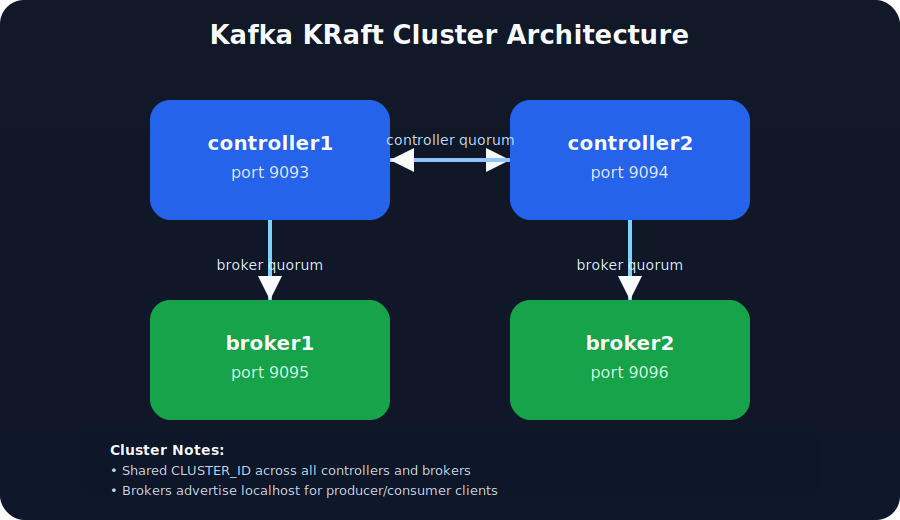
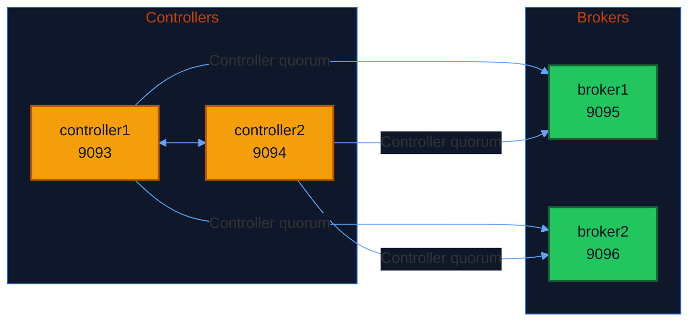

# Kafka KRaft Cluster Architecture

This document describes the Docker Compose deployment for a Kafka KRaft cluster consisting of two controller nodes and two broker nodes. It includes a visual illustration and a Mermaid diagram for GitHub rendering.

## Architecture Overview

- `controller1` and `controller2` are KRaft controller nodes responsible for cluster metadata and quorum management.
- `broker1` and `broker2` are broker nodes that handle producer and consumer traffic.
- All nodes share a common `CLUSTER_ID`, ensuring they are part of the same KRaft cluster.

## Cluster Illustration

## Mermaid Diagram

## Deployment Notes

- Both controller nodes are configured in the same controller quorum using `KAFKA_CONTROLLER_QUORUM_VOTERS`.
- Broker nodes advertise `localhost` ports to allow local producer/consumer access.
- The broker configuration sets `KAFKA_OFFSETS_TOPIC_REPLICATION_FACTOR=2`, which provides redundancy for consumer offset storage.
- Listener security is configured using `KAFKA_LISTENER_SECURITY_PROTOCOL_MAP=CONTROLLER:PLAINTEXT,BROKER:PLAINTEXT` for plaintext communication.
- Persistent local log directories are mounted under `/tmp` for each node.

## Summary

This setup demonstrates a minimal KRaft-based Kafka cluster suitable for local development and interview demonstration purposes. It highlights the separation of controller and broker roles while preserving cluster metadata and replication behavior.
